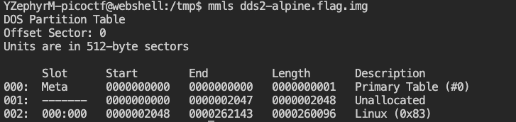
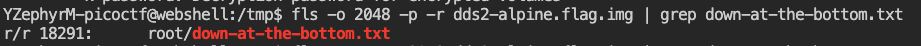
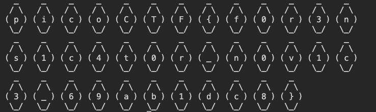

# Disk, disk, sleuth! II

Firstly, I download the .gz file and decompress it. 
Next, I analyze the disk image though `mmls` command to find the main partition.

As we can see in the screenshot, 'Linux (0x83)' is the main partition and following one of tips, I visit the [Sleuthkit docs](http://wiki.sleuthkit.org/index.php?title=TSK_Tool_Overview) which explains that `fls` can list allocated and deleted file names in a directory. Thus, with the command `man` help and what I studied previously I found the path and the inode number of the doc.

In the end, we can print the file using `icat`:

