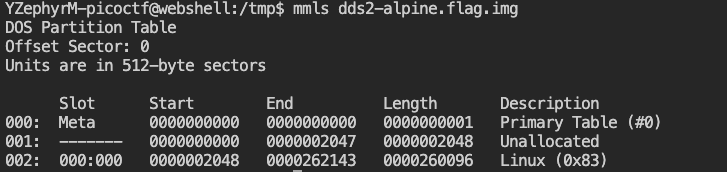
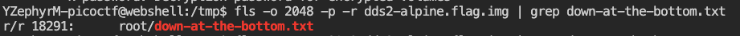
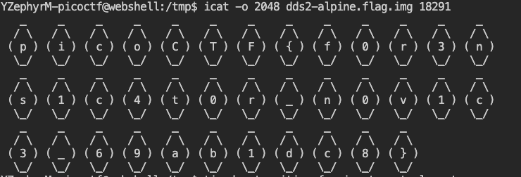

# Disk, disk, sleuth! II ([link](https://play.picoctf.org/practice/challenge/137))

First, I downloaded the `.gz` file and decompressed it. 
Next, I analyzed the disk image though `mmls` command to identify the main partition.

As shown in the screenshot, 'Linux (0x83)' is the main partition. Following one of the tips, I referred to the [Sleuthkit docs](http://wiki.sleuthkit.org/index.php?title=TSK_Tool_Overview), which explains that `fls` can both list allocated and deleted file names in a directory. Thus, I found the path and the inode number of the doc with the command `man` help and what I studied previously.

Eventually, we can print the file using `icat`:

