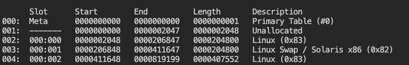
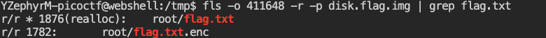
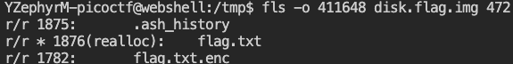
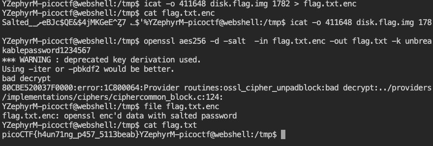

# Operation Orchid ([link](https://play.picoctf.org/practice/challenge/285))

After downloading the compressed disk image, I identified its file type using the `files` command and decompressed it.
Then I examined the disk structure using `mmls` command.





Faced with two main partions (see screenshot), I first attempted to search for `flag.txt` 
```
fls -o [sector of the partition] -r -p disk.img | grep flag.txt
```

The output revealed that the target file was located in the root dictory of the second partition (starting at sector `411648`).







The real challenge emerged when I realized:
- The original `flag.txt` was reallocated.
- The output of flag.txt.env was unreadable.


After a large troubleshooting, I discovered that inscpecting `.ash_history` (the shell command history of the system), which was found in the same directory with the two target file (inode number: 1875), could be the significant breakthrough.


At the time, I wasn't fully aware of how encryption worked in this context. Digging deeper, their purpose became a bit clear:

1. Encryption
``` bash
openssl aes256 -salt -in flag.txt -out flag.txt.enc -k unbreakblepassowerd1234567
```
- AES-256: Military-grade encryption
- Salt: data preveting precomputed attacks
- `-in flag.txt` specifies the input file
- `-out flag.txt.enc` speciefies the output file
- `-k unbreakblepassword1234567` is the password

2. Shred
``` bash
shred -u flag.txt
```
- `shred` overwrites the `flag.txt` 3 times
- `-u` erases metadata so removed all traces

I copied the file `flag.txt.enc` in `/tmp` to work better with file and eventually I make it!!!





# P.S.
The warning and error occurred because the challenge is using an outdated and insecure key derivation method in OpenSSL.

- Deprecated Key Derivation 
Older OpenSSL versions (and your command) use a weak key generation method (-k password). Modern versions warn about this because:

    - It hashes the password only once (vulnerable to brute-force attacks)

    - Lacks salt iteration (makes rainbow tables effective) 

- Bad Decrypt Error
This typically means either:

    - Wrong password (most common)

    - Corrupted encrypted file

    - Using mismatched encryption/decryption parameters

## Possible Improvement 

```
openssl enc -aes-256-cbc -d -salt -pbkdf2 -iter 100000 \
    -in flag.txt.enc -out flag.txt -k yourpassword 
```

- `-pdkdf2`: Uses PBKDF2 key derivation (resistant to brute force)
- `-iter 100000`: Adds computational work (slows down attacks)
