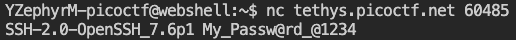
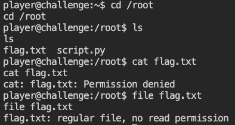
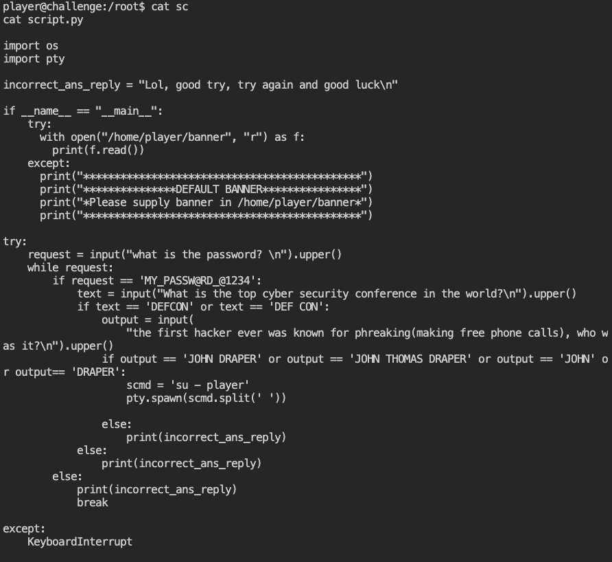
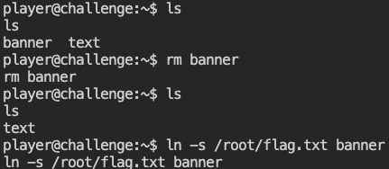
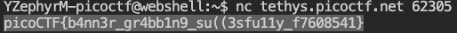

# dont-you-love-banners ([link](https://play.picoctf.org/practice/challenge/437))

First, I logged into the first server trying to obtain the crucial information (see problem).





Then, I connected to the running application, after answering some question.


As hints given by problem, I entered in `/root`, but I found that I didn't have permission to read `flag.txt` file.





At that point I didn't a clue how to continue this challenge, so I watched the "Hints" section to have inspiration.

> Do you know about symlinks?

Actually I didn't ever heard about this term, thus I did my own research about that.
**Symbolic links**, or **symlinks**, are basically advanced shortcuts. A symbolic you create will apperear to be the same as the original **file or folder** it's pointing at:

```
ln -s /path/to/original /path/to/link
```

As shown on "permission denied", there was an another file named `script.py` with my target:





Reading through it, I realized that it was the same programme that runs when you connect to the server and it is so for the banner in `player` directory.
So I attempted to delete the original banner, then created a symlink of this flag nammed as banner in the `player` directory. Doing so, when I reconnected to this server, I would have the flag.





And it was right !!!


> flag = picoCTF{b4nn3r_gr4bb1n9_su((3sfu11y_f7608541}



