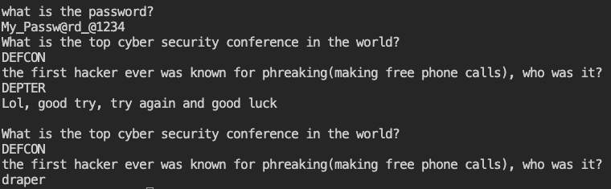

# dont-you-love-banners ([link](https://play.picoctf.org/practice/challenge/437))

I began by logging into the first server to gather crucial information about the challenge:


Then, I connected to the running application, after answering some question.





Following hint given by problem, I entered in `/root`, but I found that I didn't have permission to read `flag.txt` file.


At that point I was stuck, so I watched the "Hints" section to have inspiration.

> Do you know about symlinks?

Actually I didn't ever heard about this term, thus I did my own research about that:

> **Symbolic links**, or **symlinks**, are basically advanced shortcuts. A symbolic you create will apperear to be the same as the original **file or folder** it's pointing at:

```
ln -s /path/to/original /path/to/link
```

As shown on "permission denied" screenshot, there was an another file named `script.py` with my target:


This script was the **same programm** that ran when connecting to the server, and displayed a banner from the `player` directory.

So an idea came out:
1. Delete the original banner in the `player` directory.
2. Create a symlink named `banner` poiting to `/root/flag.txt`
3. Reconnect to the server


And it was successful!!!


> flag = picoCTF{b4nn3r_gr4bb1n9_su((3sfu11y_f7608541}


